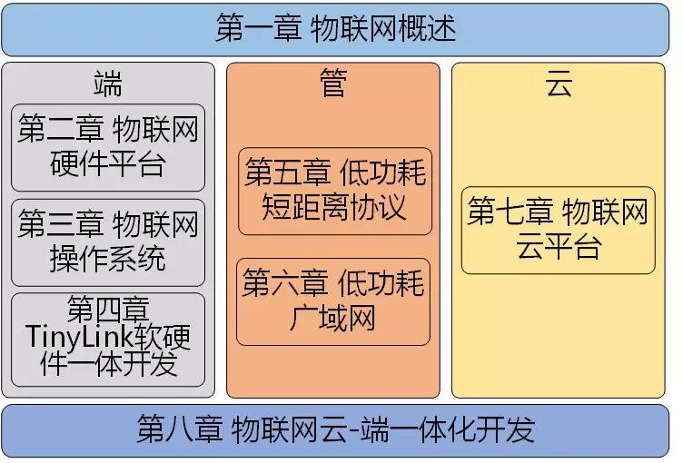

# 内容简介

本书共分8 章。内容涉及物联网“端-管-云”全链路开发流程。
第1章介绍物联网发展现状、应用架构、典型应用；
第2、3 章分别从硬件平台和操作系统的角度介绍物联网设备端开发；
第4 章介绍基于TinyLink 系统的物联网设备端快速开发；
第5、6 章分别介绍物联网应用中常用的低功耗短距离以及长距离通信技术；
第7、8 章分别介绍目前主流的物联网云平台和物联网云-端一体化开发平台。

# 本书面向的读者

本书适合作为高等院校计算机、通信、物联网工程等专业的高年级本科生、研究生的教学用书， 也适合作为物联网专业开发人员的技术参考用书。

# 课件、案例代码及视频
| 章节                     | 课件                                                         | 案例代码                                                     | 案例演示视频                                                 |
| ------------------------ | ------------------------------------------------------------ | ------------------------------------------------------------ | ------------------------------------------------------------ |
| 第一章：物联网概述       | [地址](https://pan.zju.edu.cn/share/56955a0a2737cc6fc26ce3efcd) |                                                              |                                                              |
| 第二章：物联网硬件平台   | [地址](https://pan.zju.edu.cn/share/b23e4e960cf4805dbcb6b6f64a) | [室内环境监测](https://github.com/emnets-zju/IoTBook/tree/master/%E5%90%84%E7%AB%A0%E2%80%9D%E6%A1%88%E4%BE%8B%E5%BC%80%E5%8F%91%E2%80%9C%E4%BB%A3%E7%A0%81/%E7%AC%AC%E4%BA%8C%E7%AB%A0) | [室内环境监测](https://www.bilibili.com/video/av44248541/?p=2) |
| 第三章：物联网操作系统   | [地址](https://pan.zju.edu.cn/share/5f95f925116f772da835d30c04) | [物联网防盗节点](https://github.com/emnets-zju/IoTBook/tree/master/%E5%90%84%E7%AB%A0%E2%80%9D%E6%A1%88%E4%BE%8B%E5%BC%80%E5%8F%91%E2%80%9C%E4%BB%A3%E7%A0%81/%E7%AC%AC%E4%B8%89%E7%AB%A0) | [物联网防盗节点](https://www.bilibili.com/video/av44248541/?p=3) |
| 第四章：TinyLink开发     | [地址](https://pan.zju.edu.cn/share/e9426eaf1cf4022deb7e4eecc2) | [物联网防盗节点](https://github.com/emnets-zju/IoTBook/tree/master/%E5%90%84%E7%AB%A0%E2%80%9D%E6%A1%88%E4%BE%8B%E5%BC%80%E5%8F%91%E2%80%9C%E4%BB%A3%E7%A0%81/%E7%AC%AC%E5%9B%9B%E7%AB%A0) | [物联网防盗节点](https://www.bilibili.com/video/av44248541/?p=4) |
| 第五章：低功耗短距离通信 | [地址](https://pan.zju.edu.cn/share/fbee088776159b555d952f5aab) | [智能灯泡远程控制](https://github.com/emnets-zju/IoTBook/tree/master/%E5%90%84%E7%AB%A0%E2%80%9D%E6%A1%88%E4%BE%8B%E5%BC%80%E5%8F%91%E2%80%9C%E4%BB%A3%E7%A0%81/%E7%AC%AC%E4%BA%94%E7%AB%A0) | [智能灯泡远程控制](https://www.bilibili.com/video/av44248541/?p=5) |
| 第六章：低功耗广域网     | [地址](https://pan.zju.edu.cn/share/215f61185c2766bab665496cfd) | [智能垃圾桶](https://github.com/emnets-zju/IoTBook/tree/master/%E5%90%84%E7%AB%A0%E2%80%9D%E6%A1%88%E4%BE%8B%E5%BC%80%E5%8F%91%E2%80%9C%E4%BB%A3%E7%A0%81/%E7%AC%AC%E5%85%AD%E7%AB%A0) | [智能垃圾桶](https://www.bilibili.com/video/av44248541/?p=6) |
| 第七章：物联网云平台     | [地址](https://pan.zju.edu.cn/share/42f9902e2132d227d7d8f54f74) | [语音控制智能电灯](https://github.com/emnets-zju/IoTBook/tree/master/%E5%90%84%E7%AB%A0%E2%80%9D%E6%A1%88%E4%BE%8B%E5%BC%80%E5%8F%91%E2%80%9C%E4%BB%A3%E7%A0%81/%E7%AC%AC%E4%B8%83%E7%AB%A0) | [语音控制智能电灯](https://www.bilibili.com/video/av44248541/?p=7) |
| 第八章：云-端一体开发    | [地址](https://pan.zju.edu.cn/share/09487a564aa049fef019efc912) | [座位统计系统](https://github.com/emnets-zju/IoTBook/tree/master/%E5%90%84%E7%AB%A0%E2%80%9D%E6%A1%88%E4%BE%8B%E5%BC%80%E5%8F%91%E2%80%9C%E4%BB%A3%E7%A0%81/%E7%AC%AC%E5%85%AB%E7%AB%A0) | [座位统计系统](https://www.bilibili.com/video/av44248541/?p=8) |

# 教材在线阅读材料

- 第三章
  - [Huawei LiteOS](https://github.com/emnets-zju/IoTBook/blob/master/%E7%94%B5%E5%AD%90%E6%9D%90%E6%96%99/%E7%AC%AC%E4%B8%89%E7%AB%A0/Huawei-LiteOS.md)
  - [不同OS硬件支持列表](https://github.com/emnets-zju/IoTBook/blob/master/%E7%94%B5%E5%AD%90%E6%9D%90%E6%96%99/%E7%AC%AC%E4%B8%89%E7%AB%A0/%E7%A1%AC%E4%BB%B6%E6%94%AF%E6%8C%81%E5%88%97%E8%A1%A8.md)
- 第五章
  - [6LoWPAN详述](https://github.com/emnets-zju/IoTBook/blob/master/%E7%94%B5%E5%AD%90%E6%9D%90%E6%96%99/%E7%AC%AC%E4%BA%94%E7%AB%A0/6LoWPAN.md)
  - [CC2420通信能耗](https://github.com/emnets-zju/IoTBook/blob/master/%E7%94%B5%E5%AD%90%E6%9D%90%E6%96%99/%E7%AC%AC%E4%BA%94%E7%AB%A0/CC2420%E9%80%9A%E4%BF%A1.md)
  - [CTP帧结构](https://github.com/emnets-zju/IoTBook/blob/master/%E7%94%B5%E5%AD%90%E6%9D%90%E6%96%99/%E7%AC%AC%E4%BA%94%E7%AB%A0/CTP%E5%B8%A7%E7%BB%93%E6%9E%84.md)
  - [IEEE 802.15.4物理层信道分配](https://github.com/emnets-zju/IoTBook/blob/master/%E7%94%B5%E5%AD%90%E6%9D%90%E6%96%99/%E7%AC%AC%E4%BA%94%E7%AB%A0/IEEE802.15.4%E7%89%A9%E7%90%86%E5%B1%82%E4%BF%A1%E9%81%93%E5%88%86%E9%85%8D.md)
  - [WiseMAC](https://github.com/emnets-zju/IoTBook/blob/master/%E7%94%B5%E5%AD%90%E6%9D%90%E6%96%99/%E7%AC%AC%E4%BA%94%E7%AB%A0/WISEMAC.md)
  - [其它常见的接收方发起的MAC机制](https://github.com/emnets-zju/IoTBook/blob/master/%E7%94%B5%E5%AD%90%E6%9D%90%E6%96%99/%E7%AC%AC%E4%BA%94%E7%AB%A0/%E6%8E%A5%E6%94%B6%E6%96%B9%E5%8F%91%E8%B5%B7MAC%E6%9C%BA%E5%88%B6.md)
  - [自适应侦听机制](https://github.com/emnets-zju/IoTBook/blob/master/%E7%94%B5%E5%AD%90%E6%9D%90%E6%96%99/%E7%AC%AC%E4%BA%94%E7%AB%A0/%E8%87%AA%E9%80%82%E5%BA%94%E4%BE%A6%E5%90%AC%E6%9C%BA%E5%88%B6.md)
  - [错误唤醒问题](https://github.com/emnets-zju/IoTBook/blob/master/%E7%94%B5%E5%AD%90%E6%9D%90%E6%96%99/%E7%AC%AC%E4%BA%94%E7%AB%A0/%E9%94%99%E8%AF%AF%E5%94%A4%E9%86%92%E9%97%AE%E9%A2%98.md)
- 第六章
  - [NB-IoT物理下行控制信道NPDCCH](https://github.com/emnets-zju/IoTBook/blob/master/%E7%94%B5%E5%AD%90%E6%9D%90%E6%96%99/%E7%AC%AC%E5%85%AD%E7%AB%A0/NB-IoT%E7%89%A9%E7%90%86%E4%B8%8B%E8%A1%8C%E6%8E%A7%E5%88%B6%E4%BF%A1%E9%81%93NPDCCH.md)
  - [NB-IoT下行参考信号NRS](https://github.com/emnets-zju/IoTBook/blob/master/%E7%94%B5%E5%AD%90%E6%9D%90%E6%96%99/%E7%AC%AC%E5%85%AD%E7%AB%A0/%E4%B8%8B%E8%A1%8C%E5%8F%82%E8%80%83%E4%BF%A1%E5%8F%B7NRS.md)
- 第七章
  - [HTTP报文格式](https://github.com/emnets-zju/IoTBook/blob/master/%E7%94%B5%E5%AD%90%E6%9D%90%E6%96%99/%E7%AC%AC%E4%B8%83%E7%AB%A0/HTTP%E6%8A%A5%E6%96%87%E6%A0%BC%E5%BC%8F.md)
  - [设备认证](https://github.com/emnets-zju/IoTBook/blob/master/%E7%94%B5%E5%AD%90%E6%9D%90%E6%96%99/%E7%AC%AC%E4%B8%83%E7%AB%A0/%E8%AE%BE%E5%A4%87%E8%AE%A4%E8%AF%81.md)
- 第八章
  - [三星SmartThings平台](https://github.com/emnets-zju/IoTBook/blob/master/%E7%94%B5%E5%AD%90%E6%9D%90%E6%96%99/%E7%AC%AC%E5%85%AB%E7%AB%A0/SmartThings.md)

# 阿里云物联网相关阅读材料 

- [物联网设备接入](https://help.aliyun.com/document_detail/42648.html?spm=a2c4g.11186623.6.568.66ca3f69j0iIfV)
- [物联网设备管理](https://help.aliyun.com/document_detail/130819.html?spm=a2c4g.11186623.3.2.25085cbfEYwdyf)
- [物联网数据分析](https://help.aliyun.com/product/113682.html?spm=a2c4g.11186623.6.540.c0461a5foxsTEQ)
- [IoT Studio 物联网应用开发](https://studio.iot.aliyun.com/doc?spm=a2c56.12526802.1304866.2.487a107b7zlHO4)
- [物联网络管理平台-Link WAN](https://help.aliyun.com/product/96281.html?spm=a2c4g.11186623.6.540.38f03532ZSSs9B)
- [物联网边缘计算-Link Edge](https://help.aliyun.com/product/69083.html?spm=a2c56.196096.1029272.2.60ca25c8h7op90)
- [AliOS Things](http://aliosthings.io/?spm=a2c56.196098.1029293.1.589e25c8Ke9IKH#/zh-cn/?id=alios-things)
- [物联网设备身份认证](https://help.aliyun.com/product/100846.html?spm=a2c4g.11186623.6.540.2f6a43b3iPKaZc)
- [物联网安全运营中心-Link SOC](https://dev.iot.aliyun.com/doc/detail/security_operation_center?spm=a2c56.229253.1219445.2.5a4c5f3eTDfovW#index.html)
- [物联网视频服务Link Visual](https://help.aliyun.com/product/103976.html?spm=a2c4g.11186623.6.540.758aee0fTiqcO5)

# 其他
- [阿里云IoT官网](https://iot.aliyun.com/)
- [物联网智库推荐](https://mp.weixin.qq.com/s/0mpmAVW7d9oTyEpapoZoXg)
- [京东购买链接](https://item.jd.com/12638682.html)
- 联系作者：dongw@126.com